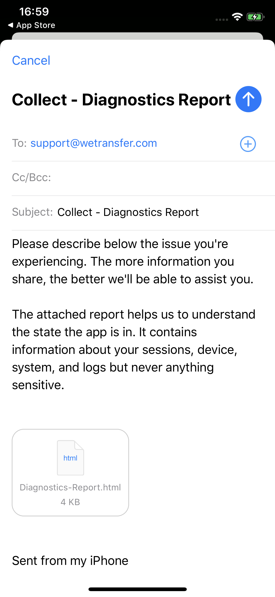
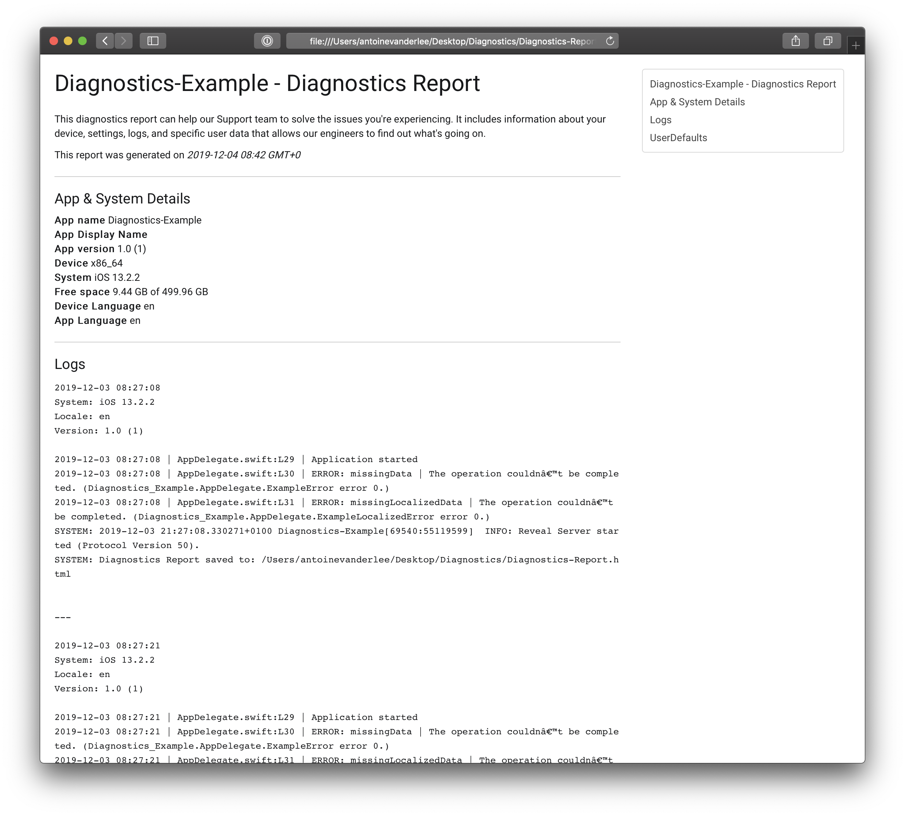
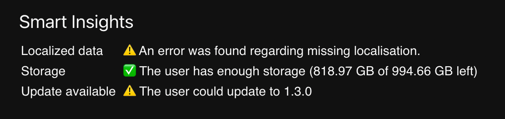

<p align="center">
    
</p>

<p align="center">


</p>

| Example mail composer | Example Report |
| --- | --- |
|  |  |

Diagnostics is a library written in Swift which makes it really easy to share Diagnostics Reports to your support team.

- [Features](#features)
- [Requirements](#requirements)
- [Usage](#usage)
	- [Using a custom UserDefaults type](#using-a-custom-userdefaults-type) 
	- [Filtering out sensitive data](#filtering-out-sensitive-data) 
	- [Adding your own custom logs](#adding-your-own-custom-logs)
	- [Adding your own custom report](#adding-your-own-custom-report)
    - [Smart insights](#smart-insights)   
- [Communication](#communication)
- [Installation](#installation)
- [Release Notes](#release-notes)
- [License](#license)

## Features

The library allows to easily attach the Diagnostics Report as an attachment to the `MFMailComposeViewController`.

- [x] Integrated with the `MFMailComposeViewController`
- [x] Default reporters include:
    - App metadata
    - System metadata
    - System logs divided per session
    - UserDefaults
- [x] Possibility to filter out sensitive data using a `DiagnosticsReportFilter`
- [x] A custom `DiagnosticsLogger` to add your own logs
- [x] Smart insights like _"⚠️ User is low on storage"_ and *"✅ User is using the latest app version"*
- [x] Flexible setup to add your own smart insights
- [x] Flexible setup to add your own custom diagnostics
- [x] Native cross-platform support, e.g. iOS, iPadOS and macOS

## Usage

The default report already contains a lot of valuable information and could be enough to get you going. 

Make sure to set up the `DiagnosticsLogger` as early as possible to catch all the system logs, for example in the `didLaunchWithOptions`:

```swift
func application(_ application: UIApplication, didFinishLaunchingWithOptions launchOptions: [UIApplication.LaunchOptionsKey: Any]?) -> Bool {
    do {
        try DiagnosticsLogger.setup()
    } catch {
        print("Failed to setup the Diagnostics Logger")
    }
    return true
}
```

Then, simply show the `MFMailComposeViewController` using the following code:

```swift
import UIKit
import MessageUI
import Diagnostics

class ViewController: UIViewController {

    @IBAction func sendDiagnostics(_ sender: UIButton) {
        /// Create the report.
        let report = DiagnosticsReporter.create()

        guard MFMailComposeViewController.canSendMail() else {
            /// For debugging purposes you can save the report to desktop when testing on the simulator.
            /// This allows you to iterate fast on your report.
            report.saveToDesktop()
            return
        }

        let mail = MFMailComposeViewController()
        mail.mailComposeDelegate = self
        mail.setToRecipients(["support@yourcompany.com"])
        mail.setSubject("Diagnostics Report")
        mail.setMessageBody("An issue in the app is making me crazy, help!", isHTML: false)

        /// Add the Diagnostics Report as an attachment.
        mail.addDiagnosticReport(report)

        present(mail, animated: true)
    }

}

extension ViewController: MFMailComposeViewControllerDelegate {
    func mailComposeController(_ controller: MFMailComposeViewController, didFinishWith result: MFMailComposeResult, error: Error?) {
        controller.dismiss(animated: true)
    }
}
```

On macOS you could send the report by using the `NSSharingService`:

```swift
import AppKit
import Diagnostics

func send(report: DiagnosticsReport) {
    let service = NSSharingService(named: NSSharingService.Name.composeEmail)!
    service.recipients = ["support@yourcompany.com"]
    service.subject = "Diagnostics Report"
            
    let url = URL(fileURLWithPath: NSTemporaryDirectory()).appendingPathComponent("Diagnostics-Report.html")
    
    // remove previous report
    try? FileManager.default.removeItem(at: url)

    do {
        try report.data.write(to: url)
    } catch {
        print("Failed with error: \(error)")
    }

    service.perform(withItems: [url])
}
```

### Using a custom UserDefaults type
Simply set your user defaults instance by making use of:

```swift
UserDefaultsReporter.userDefaults = ..
```

### Filtering out sensitive data
It could be that your report is containing sensitive data. You can filter this out by creating a `DiagnosticsReportFilter`.

The example project contains an example of this:

```swift
struct DiagnosticsDictionaryFilter: DiagnosticsReportFilter {

    // This demonstrates how a filter can be used to filter out sensible data.
    static func filter(_ diagnostics: Diagnostics) -> Diagnostics {
        guard let dictionary = diagnostics as? [String: Any] else { return diagnostics }
        return dictionary.filter { keyValue -> Bool in
            if keyValue.key == "App Display Name" {
                // Filter out the key with the value "App Display Name"
                return false
            } else if keyValue.key == "AppleLanguages" {
                // Filter out a user defaults key.
                return false
            }
            return true
        }
    }
}
```

Which can be used by passing in the filter into the `create(..)` method:

```swift
let report = DiagnosticsReporter.create(using: reporters, filters: [DiagnosticsDictionaryFilter.self])
```

### Adding your own custom logs
To make your own logs appear in the logs diagnostics you need to make use of the `DiagnosticsLogger`. 

```swift
/// Support logging simple `String` messages.
DiagnosticsLogger.log(message: "Application started")

/// Support logging `Error` types.
DiagnosticsLogger.log(error: ExampleError.missingData)
```

The error logger will make use of the localized description if available which you can add by making your error conform to `LocalizedError`.

### Adding a directory tree report
It's possible to add a directory tree report for a given set of URL, resulting in the following output:

```
└── Documents
    +-- contents
    |   +-- B3F2F9AD-AB8D-4825-8369-181DEAAFF940.png
    |   +-- 5B9C090E-6CE1-4A2F-956B-15897AB4B0A1.png
    |   +-- 739416EF-8FF8-4502-9B36-CEB778385BBF.png
    |   +-- 27A3C96B-1813-4553-A6B7-436E6F3DBB20.png
    |   +-- 8F176CEE-B28F-49EB-8802-CC0438879FBE.png
    |   +-- 340C2371-A81A-4188-8E04-BC19E94F9DAE.png
    |   +-- E63AFEBC-B7E7-46D3-BC92-E34A53C0CE0A.png
    |   +-- 6B363F44-AB69-4A60-957E-710494381739.png
    |   +-- 9D31CA40-D152-45D9-BDCE-9BB09CCB825E.png
    |   +-- 304E2E41-9697-4F9A-9EE0-8D487ED60C45.jpeg
    |   └── 7 more file(s)
    +-- diagnostics_log.txt
    +-- Okapi.sqlite
    +-- Library
    |   +-- Preferences
    |   |   └── group.com.wetransfer.app.plist
    |   └── Caches
    |       └── com.apple.nsurlsessiond
    |           └── Downloads
    |               └── com.wetransfer
    +-- Coyote.sqlite-shm
    +-- Coyote.sqlite
    +-- Coyote.sqlite-wal
    +-- Okapi.sqlite-shm
    +-- Okapi.sqlite-wal
    └── 1 more file(s)
```

You can do this by adding the `DirectoryTreesReporter`:

```swift
var reporters = DiagnosticsReporter.DefaultReporter.allReporters
let documentsURL = try! FileManager.default.url(for: .documentDirectory, in: .userDomainMask, appropriateFor: nil, create: false)
let directoryTreesReporter = DirectoryTreesReporter(
    directories: [
        documentsURL
    ]
)
reporters.insert(directoryTreesReporter, at: 1)
```

### Adding your own custom report
To add your own report you need to make use of the `DiagnosticsReporting` protocol.

```swift
/// An example Custom Reporter.
struct CustomReporter: DiagnosticsReporting {
    static func report() -> DiagnosticsChapter {
        let diagnostics: [String: String] = [
            "Logged In": Session.isLoggedIn.description
        ]

        return DiagnosticsChapter(title: "My custom report", diagnostics: diagnostics)
    }
}
```

You can then add this report to the creation method:

```swift
var reporters = DiagnosticsReporter.DefaultReporter.allReporters
reporters.insert(CustomReporter.self, at: 1)
let report = DiagnosticsReporter.create(using: reporters)
```

## Smart Insights

By default, standard Smart Insights are provided:

- `UpdateAvailableInsight` uses your bundle identifier to fetch the latest available app version. An insight will be shown whether an update is available to the user or not.
- `DeviceStorageInsight` shows whether the user is out of storage or not

### Adding your own custom insights
It's possible to provide your own custom insights based on the chapters in the report. A common example is to parse the errors and show a smart insight about an occurred error:

```swift
struct SmartInsightsProvider: SmartInsightsProviding {
    func smartInsights(for chapter: DiagnosticsChapter) -> [SmartInsightProviding] {
        guard let html = chapter.diagnostics as? HTML else { return [] }
        if html.errorLogs.contains(where: { $0.contains("AppDelegate.ExampleLocalizedError") }) {
            return [
                SmartInsight(
                    name: "Localized data",
                    result: .warn(message: "An error was found regarding missing localisation.")
                )
            ]
        }
        return []
    }
}
```

The example project provides the above sample code for you to try out. You can make use of `html.errorLogs`, `.debugLogs`, and `.systemLogs` to quickly access specific logs from the report.

#### Creating a custom HTML formatter for your report
You can make use of the `HTMLFormatting` protocol to customize the way the HTML is reported. 

Simply pass in the formatter into the `DiagnosticsChapter` initialiser:

```swift
DiagnosticsChapter(title: "UserDefaults", diagnostics: userDefaults, formatter: <#HTMLFormatting.Type#>)
```

## Communication

- If you **found a bug**, open an issue.
- If you **have a feature request**, open an issue.
- If you **want to contribute**, submit a pull request.

## Installation

### Swift Package Manager

The [Swift Package Manager](https://swift.org/package-manager/) is a tool for managing the distribution of Swift code. It’s integrated with the Swift build system to automate the process of downloading, compiling, and linking dependencies.

#### Manifest File

Add Diagnostics as a package to your `Package.swift` file and then specify it as a dependency of the Target in which you wish to use it.

```swift
import PackageDescription

let package = Package(
    name: "MyProject",
    platforms: [
       .macOS(.v10_15)
    ],
    dependencies: [
        .package(url: "https://github.com/WeTransfer/Diagnostics.git", .upToNextMajor(from: "1.8.0"))
    ],
    targets: [
        .target(
            name: "MyProject",
            dependencies: ["Diagnostics"]),
        .testTarget(
            name: "MyProjectTests",
            dependencies: ["MyProject"]),
    ]
)
```

#### Xcode

To add Diagnostics as a [dependency](https://developer.apple.com/documentation/xcode/adding_package_dependencies_to_your_app) to your Xcode project, select *File > Swift Packages > Add Package Dependency* and enter the repository URL: `https://github.com/WeTransfer/Diagnostics.git`.

### Carthage

[Carthage](https://github.com/Carthage/Carthage) is a decentralized dependency manager that builds your dependencies and provides you with binary frameworks.

You can install Carthage with [Homebrew](http://brew.sh/) using the following command:

```bash
$ brew update
$ brew install carthage
```

To integrate Diagnostics into your Xcode project using Carthage, specify it in your `Cartfile`:

```ogdl
github "WeTransfer/Diagnostics" ~> 1.00
```

Run `carthage update` to build the framework and drag the built `Diagnostics.framework` into your Xcode project.

### Manually

If you prefer not to use any of the aforementioned dependency managers, you can integrate Diagnostics into your project manually.

#### Embedded Framework

- Open up Terminal, `cd` into your top-level project directory, and run the following command "if" your project is not initialized as a git repository:

  ```bash
  $ git init
  ```

- Add Diagnostics as a git [submodule](http://git-scm.com/docs/git-submodule) by running the following command:

  ```bash
  $ git submodule add https://github.com/WeTransfer/Diagnostics.git
  ```

- Open the new `Diagnostics` folder, and drag the `Diagnostics` folder into the Project Navigator of your application's Xcode project. This will add the SPM package as a local package.

    > It should appear nested underneath your application's blue project icon. Whether it is above or below all the other Xcode groups does not matter.

- Next, select your application project in the Project Navigator (blue project icon) to navigate to the target configuration window and select the application target under the "Targets" heading in the sidebar.
- In the tab bar at the top of that window, open the "General" panel.
- Click on the `+` button under the "Embedded Binaries" section.
- Select `Diagnostics.framework`.
- And that's it!

  > The `Diagnostics.framework` is automagically added as a target dependency, linked framework and embedded framework in a copy files build phase which is all you need to build on the simulator and a device.

---

## Release Notes

See [CHANGELOG.md](https://github.com/WeTransfer/Diagnostics/blob/master/Changelog.md) for a list of changes.

## Authors
This library is created as part of the [WeTransfer](https://www.wetransfer.com) Hackathon. Process has been reported on [Twitter](https://twitter.com/twannl/status/1201474263200550917?s=20). 

Thanks to:

- ["Offie"](https://twitter.com/offinga) for the HTML report
- [Casper](https://twitter.com/_casperlourens) for the awesome logo
- [Antoine](https://www.twitter.com/twannl) for the Swift Library

Also, a little shoutout to [1Password](https://www.1password.com) for [inspiring us](https://twitter.com/twannl/status/1200167786749874176?s=20) to create this library.

## License

Diagnostics is available under the MIT license. See the LICENSE file for more info.
